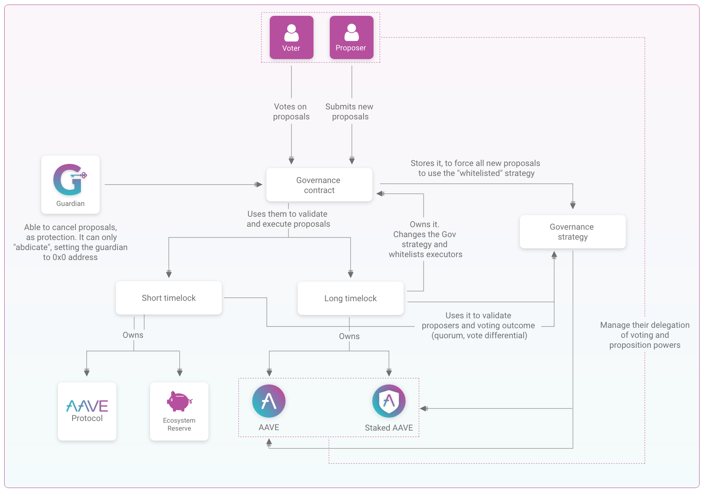

# Aave Governance v2

## Architecture



## Planned configurations for mainnet

### AaveGovernanceV2
- voting delay (time between a proposal is submitted and the voting is opened): 0 blocks, as for us this process is done beforehand in the governance forum
- guardian: Aave Guardian multisig
- executors whitelisted: Executor (short) and Executor (long)
- owner (entity able to change the strategy, voting delay and authorize/unauthorize executors): Executor 2, the long timelock 

### Executor (short)
It will control the whole Aave protocol v1, the token distributor used in v1, the contract collecting the fees of v1, the Reserve Ecosystem of AAVE and any change in this timelock itself
- admin (the only address enable to interact with this executor): Aave Governance v2
- delay (time between a proposals passes and its actions get executed): 1 day
- grace period (time after the delay during which the proposal can be executed): 5 days
- proposition threshold: 0.5%
- voting duration: 3 days
- vote differential: 0.5%
- quorum: 2%

### Executor (long)
It will control the upgradeability of the AAVE token, the stkAAVE, any change in the parameters of the Governance v2 and any change in the parameters of this timelock itself
- admin: Aave Governance v2
- delay: 7 days
- grace period: 5 days
- proposition threshold: 2%
- voting duration: 10 days
- vote differential: 15%
- quorum: 20%

### Governance strategy (the contract determining how the voting/proposition powers are calculated)
- Based on AAVE+stkAAVE
- Voting and proposition power are: balanceOfAAVE + delegationReceivedOfAAVE + balanceOfstkAAVE + delegationReceivedOfstkAAVE (with delegation being voting or proposition depending on the case)
- Total voting and proposition supply: AAVE supply


## Setup

The repository uses Docker Compose to manage sensitive keys and load the configuration. Prior any action like test or deploy, you must run `docker-compose up` to start the `contracts-env` container, and then connect to the container console via `docker-compose exec contracts-env bash`.

Follow the next steps to setup the repository:

- Install `docker` and `docker-compose`
- Create an enviroment file named `.env` and fill the next enviroment variables

```
# Mnemonic, only first address will be used
MNEMONIC=""

# Add Alchemy or Infura provider keys, alchemy takes preference at the config level
ALCHEMY_KEY=""
INFURA_KEY=""

# Your access token from Gitlab, with the api scope enabled, to install @aave-tech/aave-token package from Gitlab Package Registry. Check this guide to get one https://docs.gitlab.com/ee/user/profile/personal_access_tokens.html
GITLAB_ACCESS_TOKEN=""

# Optional Etherscan key, for automatize the verification of the contracts at Etherscan
ETHERSCAN_KEY=""

# Optional, if you plan to use Tenderly scripts
TENDERLY_PROJECT=""
TENDERLY_USERNAME=""

```

## Test

For running the test suite, run:

```
docker-compose run contracts-env npm run test
```

For running coverage, run:

```
docker-compose run contracts-env npm run coverage
```